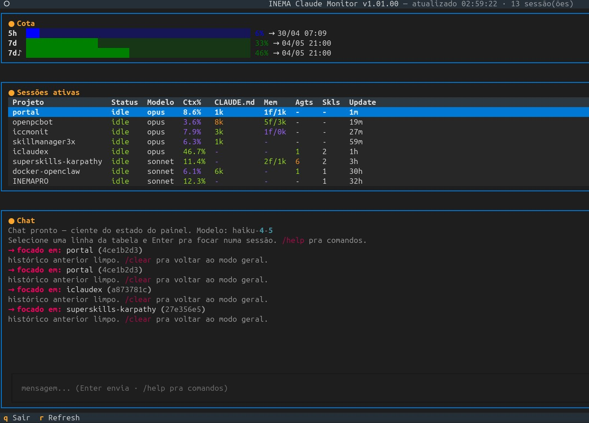

# iccmonit — INEMA Claude Monitor

TUI em Python que monitora **todas as sessões Claude Code ativas** na máquina em tempo real, com cota 5h/7d, métricas por sessão e chat embutido via OAuth.

Pensado para rodar em um **terminal separado** ao lado das suas sessões Claude Code, dando visão consolidada de:

- Sessões ativas (busy / idle), modelo em uso, % do contexto consumido
- Cota da API: janela de 5 horas, semanal global e semanal Sonnet (separada)
- Tamanho do `CLAUDE.md`, da memória do projeto, agentes lançados e skills invocadas
- Chat com Claude (Haiku por padrão) ciente do estado do painel

Versão atual: **v1.17.11**



---

## Sumário

- [Requisitos](#requisitos)
- [Instalação](#instalação)
- [Uso](#uso)
  - [Modo terminal](#modo-terminal)
  - [Modo web](#modo-web)
  - [Atalhos](#atalhos-de-teclado)
- [Painéis da TUI](#painéis-da-tui)
- [Fontes de dados](#fontes-de-dados)
- [Configuração](#configuração--configjson)
- [Arquitetura](#arquitetura)
- [Versionamento](#versionamento)
- [Roadmap](#roadmap)
- [Solução de problemas](#solução-de-problemas)
- [Por que não usar X?](#por-que-não-usar-x)
- [Licença](#licença)

---

## Requisitos

- **Python 3.10+**
- **Claude Code instalado e logado** (precisa de `~/.claude/.credentials.json` válido)
- **Statusline padrão do Claude Code rodando** — é ele que popula `/tmp/cc_limits_<uid>.json` com a cota oficial da API. Sem isso o painel de cota fica vazio.
- Sistema operacional **Linux** ou **macOS** (testado no Linux). O `tac` é usado para ler transcripts de trás pra frente — em macOS tem o equivalente.

## Instalação

```bash
git clone git@github.com:inematds/iccmonit.git
cd iccmonit
chmod +x start.sh
```

Dependências (instaladas automaticamente pelo `start.sh` se faltarem):

```bash
pip install textual anthropic --break-system-packages           # modo terminal
pip install textual-serve --break-system-packages               # modo web (extra)
```

## Uso

### Modo terminal

```bash
./start.sh
```

Abre a TUI no terminal atual. Ideal para rodar lado-a-lado com as sessões Claude Code.

### Modo web

```bash
./start.sh web                       # 127.0.0.1:8000     — apenas local (padrão)
./start.sh web 9000                  # 127.0.0.1:9000     — porta custom
./start.sh web 8000 lan              # <ip-da-LAN>:8000   — outras máquinas da rede
./start.sh web 8000 192.168.1.50     # IP específico
```

Usa o pacote **`textual-serve`** para empacotar a TUI atual num WebSocket + xterm.js no navegador, sem mudança de código. O servidor (`serve.py`) abre o navegador automaticamente.

**Modos de bind:**

| Modo | Bind | Quem acessa |
|------|------|-------------|
| padrão | `127.0.0.1` | Só o próprio host |
| `lan`  | IP da LAN auto-detectado (rota pro `8.8.8.8`) | Qualquer máquina na sub-rede |
| `<ip>` | IP fornecido | Quem rotear até esse IP |

> ⚠ **Sem autenticação.** No modo `lan`, qualquer um na rede com o IP+porta acessa o monitor — incluindo o chat OAuth conectado à sua conta. Use só em rede de confiança. Pra acesso através da internet, prefira **SSH tunnel** em vez de expor a porta:
>
> ```bash
> ssh -L 8000:localhost:8000 usuario@maquina
> ```
>
> Bindar em `0.0.0.0` está **bloqueado** porque o `textual-serve` embute o host de bind no websocket e o navegador rejeita conexão WS pra `0.0.0.0`. Útil pra:

- Acompanhar de outra máquina na rede local (acesse `http://<ip-da-maquina>:8000`)
- Manter o monitor visível num browser sem ocupar terminal
- Compartilhar visão temporária com colegas na mesma rede

### Ajuda

```bash
./start.sh -h    # mostra os modos disponíveis
```

### Atalhos de teclado

| Tecla | Ação |
|-------|------|
| `r`   | Refresh manual |
| `a`   | Alterna entre **Sessões ativas** ↔ **todas** (vivas + mortas) |
| `p`   | Liga/desliga o painel **Processos** (top N da máquina) |
| `v`   | Liga/desliga o painel **Serviços** (Docker + systemd boot) |
| `s`   | Quando Processos visível: alterna ordenação **CPU% ↔ RAM%** |
| `,`   | Encolhe a coluna esquerda em 5% (chat fica maior) |
| `.`   | Aumenta a coluna esquerda em 5% (chat fica menor) |
| `=`   | Reseta a divisão em 50/50 |
| `1`   | Abre **Cota** em fullscreen modal |
| `2`   | Abre **Máquina** em fullscreen |
| `3`   | Abre **Processos** em fullscreen |
| `4`   | Abre **Sessões** em fullscreen |
| `5`   | Abre **Serviços** em fullscreen (Docker completo + systemd boot completo) |
| **click** no título de uma seção | Mesmo efeito do `1`-`4` correspondente |
| `Esc` ou `q` (no modal) | Fecha o modal |
| `q`   | Sair |

Auto-refresh a cada **10 segundos** por padrão (configurável em `config.json` via `refresh_interval_seconds`). A coleta (lê transcripts grandes, roda `nvidia-smi`, `docker ps`, etc.) acontece numa **worker thread** — a TUI não congela e os valores antigos ficam na tela até o novo lote chegar. O subtitle do header mostra **"atualizado há Xs"** ticando a cada segundo.

Chat também é assíncrono: ao enviar, a mensagem aparece na hora com `aguardando claude...` enquanto a API responde em background. Mandar nova mensagem antes da anterior chegar é bloqueado com aviso.

---

## Painéis da TUI

A TUI tem layout em duas colunas (50/50 por padrão, redimensionável com `,` `.` `=`):

- **Esquerda** — empilha verticalmente: Cota → Máquina → Processos (opcional) → Sessões
- **Direita** — Chat ocupando toda a altura

Limites de redimensionamento: 20% / 80%. Não fica tudo de um lado só.

### 1. Cota (topo)

Barra horizontal por janela:

| Linha | Significado |
|-------|-------------|
| `5h`  | Janela rolante de 5 horas — todos os modelos |
| `7d`  | Janela semanal — todos os modelos |
| `7d♪` | Janela semanal **Sonnet** — limite separado, importante monitorar |

Cor da barra segue os thresholds de `quota_pct` em `config.json`. Se a barra aparecer "aguardando API..." é porque o cache `/tmp/cc_limits_<uid>.json` está vazio ou velho (> 2 min).

### 2. Máquina

Uso de hardware do servidor — barras coloridas pelos thresholds de `system_pct`:

| Linha | Mostra |
|-------|--------|
| `CPU`  | `usage_pct` (load1 / cores) + load 1m/5m/15m + nº de cores |
| `RAM`  | `used / total MB` + swap usado |
| `Disk` | `used / total GB` + livre |
| `GPU`  | `nvidia-smi`: utilização %, VRAM, temperatura. Linha some se não houver GPU NVIDIA. |

CPU usa `os.getloadavg()` (não `psutil`), RAM lê `/proc/meminfo`, GPU é opcional via `nvidia-smi`. Sem dependências extras.

### 3. Processos (opcional — tecla `p`)

Top N processos da máquina, ordenados por **%CPU** ou **%RAM** (alterna com `s`). Default: oculto.

| Coluna | Mostra |
|--------|--------|
| `PID` | identificador do processo |
| `User` | dono (truncado em 10 chars) |
| `CPU%` | % de CPU (cor pelos thresholds de `system_pct`) |
| `RAM%` | % de RAM (mesma escala de cor) |
| `Tempo` | etime (`HH:MM:SS` ou `D-HH:MM:SS`) |
| `Comando` | comm truncado em 40 chars |

Coleta via `ps -eo pid,user,pcpu,pmem,etime,comm --sort=-%cpu` (sem dependência extra). Útil pra:

- Saber **quais sessões `claude` estão consumindo CPU/RAM** (cada PID aparece separado)
- Detectar processos pesados quando o painel Máquina ficar 🟡/🔴
- Ver `ollama`, GPU workers, dev servers etc. na mesma tela

Configurável: `top_processes_n` no `config.json` (padrão `10`). O painel só polla `ps` quando está visível — não tem custo quando oculto.

### 4. Serviços (opcional — tecla `v`)

Resumo de **Docker** e **systemd boot** num painel só. Default: oculto.

**Inline mostra só o que importa:**

```
Docker   10/44 containers ativos
  ✓ imkt4-postgres-1     Up 4 days     0.0.0.0:5432->5432/tcp
  ✓ openclaw-ollama      Up 4 days     0.0.0.0:11434->11434/tcp
  ✓ open-webui           Up 4 days     0.0.0.0:3000->8080/tcp
  ... +7 ativos · use 5 pra ver tudo (incl. parados)
Boot     33/102 systemd .service habilitados rodando  (abra modal pra ver lista)
```

**Modal (`5`)** mostra a lista completa: todos os containers (incluindo parados, com código de saída) e todas as services systemd habilitadas com estado atual (`running`, `dead`, `exited`, `failed`).

Coleta:
- Docker via `docker ps -a` — se `docker` não estiver no `$PATH`, mostra "indisponível"
- Boot via 2 chamadas a `systemctl` (1× `list-unit-files --state=enabled`, 1× `list-units --all` para o estado) — sem polling unitário, leve
- Só roda quando o painel está visível (zero custo quando oculto)

### 5. Sessões (ativas ou todas)

Tabela com uma linha por sessão Claude Code. Por padrão mostra só sessões com PID alive; pressione **`a`** para incluir as mortas (sessões cujo arquivo em `~/.claude/sessions/*.json` ainda existe mas o processo terminou). Mortas aparecem em cinza com status `morta`. Colunas:

| Coluna | Descrição |
|--------|-----------|
| **Projeto** | Nome do diretório de trabalho (truncado em 20 chars) |
| **Status** | `idle` (verde) ou `busy` (amarelo) |
| **Modelo** | `opus`, `sonnet`, `haiku` ou outro |
| **Ctx%** | % da janela de 1M tokens em uso. Soma `input + cache_read + cache_creation + output` |
| **CLAUDE.md** | Tamanho do `CLAUDE.md` no `cwd` da sessão |
| **Mem** | `<n>f/<x>k` — número de arquivos e KB totais em `memory/` |
| **Agts** | Quantidade de chamadas à tool `Agent` no transcript |
| **Skls** | Skills distintas invocadas (tool `Skill`) |
| **Update** | Tempo desde o último update (`12s`, `3m`, `1h`) |

Cada métrica recebe cor azul/verde/amarelo/vermelho conforme thresholds em `config.json`.

### 6. Chat (lateral)

Chat embutido com Claude com **dois modos**:

**Modo geral** (padrão) — recebe o estado completo do painel como system prompt:

- "Qual sessão tá usando mais contexto?"
- "Quanto falta pra cota Sonnet?"
- "Algum projeto com memória crítica?"

**Modo focado** — selecione uma linha da tabela (↑/↓ + **Enter**) e o chat carrega o transcript daquela sessão como contexto. Aí dá pra perguntar sobre o trabalho específico:

- "O que essa sessão tá fazendo agora?"
- "Qual foi o último erro?"
- "Resume o que foi feito até agora."
- "Por que ele tomou essa decisão?"

> O chat é um **observador analítico** — não interage com o agente daquela sessão, só lê o transcript. Pra interação remota real, ver V2 no roadmap.

#### Comandos do chat

| Comando | Ação |
|---------|------|
| `/help`   | Ajuda completa (TUI + chat + skills + roadmap) |
| `/diag`   | Diagnóstico do painel — lista cota e sessões em alerta (🟡/🔴) com sugestões |
| `/skills` | 3 skills úteis pra rodar nas sessões focadas (statusline / memory-audit / handoff) |
| `/clear`  | Volta ao modo geral (limpa o foco e o histórico) |
| `/log`    | Mostra as últimas 20 linhas do log de chat |
| `/where`  | Imprime os caminhos do log, config e diretório de projects |
| `/docker` | sem args: lista containers rodando · `/docker <nome> start\|stop\|restart\|logs` age direto |
| `/fork`   | *(roadmap V2)* — abrir nova sessão Claude Code continuando a focada |

Trocar de foco também limpa o histórico do chat — pra não misturar conversas.

#### Diagnóstico do painel — `/diag`

Roda regras locais sobre os thresholds do `config.json` e devolve só o que está em **🟡 yellow** ou **🔴 red**:

- Cotas (5h, 7d, 7d Sonnet) em alerta
- Sessões com `Ctx%` alto (risco de auto-compaction)
- Sessões com memória ou `CLAUDE.md` inchados
- Sessões com muitos agentes lançados

Quando algo aparece, sugere a skill apropriada do `skillmanager3x` (`session-handoff`, `memory-audit`, etc).

#### Skills úteis — `/skills`

Lista as 3 skills do [skillmanager3x](https://github.com/inematds/skillmanager3x) com **quando usar cada uma**:

| Skill | Quando rodar |
|-------|--------------|
| **session-statusline** | Checkpoint operacional rápido durante o trabalho. Triggers: "onde estamos", "checkpoint", "organiza a sessão". |
| **memory-audit**       | Quando o painel mostra memória 🟡/🔴 ou CLAUDE.md grande. Triggers: "analise a memória", "memória inchada", "limpa memória". |
| **session-handoff**    | Antes de `/clear` ou quando ctx 🔴. Gera resumo pra um agente fresco continuar. Triggers: "vou dar /clear", "handoff", "encerrar sessão". |

Como rodar: na sessão Claude Code alvo, digite o trigger ou `/<skill-name>`.

#### Log de chat

Cada turno (você → claude) e cada erro são gravados em `chat.log` no diretório do projeto. Inclui:

- timestamp, role (user/claude), foco (`[geral]` ou `[focus=<8 chars>]`), e texto
- em caso de erro: status code e body cru da resposta da API

Útil pra debugar 401 (OAuth expirado/inválido), rate limit, payload inválido, etc. O arquivo está no `.gitignore`.

Modelo padrão: `claude-haiku-4-5-20251001` (configurável em `config.json` → `chat.model`). Autenticação via OAuth do Claude Code (token em `~/.claude/.credentials.json`).

---

## Fontes de dados

| Métrica | Fonte |
|---|---|
| Sessões ativas | `~/.claude/sessions/*.json` — um arquivo por PID, filtrado por processo vivo (`os.kill(pid, 0)`) |
| Modelo, contexto %, custo | Última mensagem `assistant` com `usage` no transcript JSONL **ativo** em `~/.claude/projects/<encoded-cwd>/`. O `sessionId` em `session.json` congela no boot — após `/clear` o Claude Code cria um JSONL novo e o monitor segue o de `mtime` mais recente |
| Cota 5h / 7d / 7d-Sonnet | `/tmp/cc_limits_<uid>.json` — cache do statusline (fonte oficial via API Anthropic) |
| `CLAUDE.md` | `stat` do arquivo em `<cwd>/CLAUDE.md` |
| Memória | Conta arquivos e soma bytes de `~/.claude/projects/<encoded-cwd>/memory/` |
| Agentes lançados | Tool uses `name == "Agent"` no transcript (acumulado na sessão) |
| Skills invocadas | Tool uses `name == "Skill"` no transcript (distintas) |
| Chat OAuth | `~/.claude/.credentials.json` → `claudeAiOauth.accessToken`. Header: `anthropic-beta: oauth-2025-04-20` |

> A cota **não** é recalculada localmente como `ccm`/`ccusage` fazem — é lida do cache que o próprio Claude Code mantém com os valores oficiais da API. Isso evita divergência.

### Encoding do `cwd`

Barras e dois pontos viram hífens, com hífen prefixado:

```
/home/user/projetos/foo  →  -home-user-projetos-foo
```

O monitor tenta ambas as variações (com e sem hífen prefixado) ao localizar transcript e diretório de memória.

---

## Configuração — `config.json`

Editável sem tocar no código. Estrutura:

### `thresholds`

Limites de cor por métrica. Cada métrica tem 4 níveis: `blue` ≤ `green` ≤ `yellow` ≤ `red`.

| Métrica | O que mede | Defaults (b/g/y/r) |
|---------|------------|--------------------|
| `quota_pct`           | % da cota usada (5h, 7d, 7d-Sonnet) | 20 / 60 / 85 / 95 |
| `context_pct`         | % da janela de contexto da sessão. >90% = risco de auto-compaction | 10 / 50 / 75 / 90 |
| `memory_kb`           | Tamanho total da memória do projeto (KB). >600 = considere `/memory-audit` | 0 / 100 / 300 / 600 |
| `memory_files`        | Número de arquivos de memória. >35 = fragmentação | 0 / 10 / 20 / 35 |
| `claude_md_bytes`     | Tamanho do `CLAUDE.md`. >40KB = pode impactar contexto | 0 / 8192 / 20480 / 40960 |
| `agents_per_session`  | Agentes lançados na sessão. >30 = sessão muito pesada | 0 / 5 / 15 / 30 |
| `cost_per_session_usd`| Custo acumulado em USD. >$20 = revisar eficiência | 0 / 2 / 8 / 20 |

Esquema visual:

| Cor | Significado |
|-----|-------------|
| 🔵 Azul | Muito baixo / ocioso |
| 🟢 Verde | Normal / saudável |
| 🟡 Amarelo | Atenção |
| 🔴 Vermelho | Crítico / alerta |

### `alerts`

Habilita/desabilita mensagens de alerta individualmente:

| Chave | Padrão | Mensagem |
|-------|--------|----------|
| `quota_5h_red`  | enabled  | ⚠ Cota 5h crítica! |
| `quota_7d_red`  | enabled  | ⚠ Cota semanal crítica! |
| `context_red`   | enabled  | ⚠ Contexto alto — risco de compaction |
| `memory_red`    | enabled  | ⚠ Memória excessiva — rode `/memory-audit` |
| `claude_md_red` | disabled | ⚠ CLAUDE.md muito grande |
| `cost_red`      | enabled  | ⚠ Sessão cara |

### `chat`

| Campo | Padrão | Descrição |
|-------|--------|-----------|
| `model`      | `claude-haiku-4-5-20251001` | Modelo do chat embutido |
| `max_tokens` | `1024` | Tamanho máximo da resposta |

### Outros

| Campo | Padrão | Descrição |
|-------|--------|-----------|
| `title` | `INEMA Claude Monitor` | Título do header (a versão é appendada automaticamente) |
| `refresh_interval_seconds` | `10` | Intervalo de auto-refresh em segundos |

---

## Arquitetura

```
iccmonit/
├── monitor.py     # TUI principal (Textual) — V1
├── serve.py       # Wrapper de modo web via textual-serve
├── start.sh       # Entrypoint: terminal e modo web
├── config.json    # Thresholds, alertas, chat, refresh
├── README.md      # Este arquivo
├── CLAUDE.md      # Instruções do projeto pra Claude Code
├── .gitignore
└── docs/
    ├── img/         # Screenshots
    ├── PLAN.md      # Plano original e decisões de arquitetura
    └── RESEARCH.md  # Pesquisa das fontes de dados do Claude Code
```

### Componentes do `monitor.py`

| Símbolo | Papel |
|---------|-------|
| `load_sessions()` | Lê `~/.claude/sessions/*.json` e filtra por PID vivo |
| `get_transcript_usage()` | Lê última `assistant.usage` do transcript via `tac` |
| `get_session_extras()` | Calcula tamanho de `CLAUDE.md`, memória, contagem de agentes/skills |
| `load_quota()` | Lê `/tmp/cc_limits_<uid>.json` (descarta se > 120s) |
| `get_oauth_token()` | Extrai `accessToken` do `.credentials.json` |
| `QuotaBar` | Widget com barras de cota |
| `SessionTable` | DataTable com sessões |
| `ChatPane` | RichLog + Input — chat com `system` montado a cada mensagem com snapshot do painel |
| `MonitorApp` | App Textual; auto-refresh via `set_interval` |

---

## Versionamento

Constante `VERSION` em `monitor.py` no formato **`v1.xx.yy`**:

- **major (`1`)** — só muda na transição para V2
- **`xx`** — incrementa a cada **recurso novo** (sequencial: `01`, `02`, ...)
- **`yy`** — incrementa a cada **bug fix** (sequencial dentro da major)
- **`yy` NÃO reinicia** quando `xx` sobe — só zera junto com `xx` na transição de major

Exemplos:
- `v1.00.00` → estado inicial
- `v1.01.00` → primeiro recurso novo (nenhum bug fix ainda)
- `v1.01.02` → após dois bugs fixados dentro do recurso `01`
- `v1.02.02` → próximo recurso (`yy` mantém em `02` porque nenhum novo bug foi corrigido)
- `v1.02.03` → bug fix sobre `v1.02.02`
- `v2.00.00` → mudança de major zera tudo

A versão é exibida no título da janela TUI (header).

---

## Roadmap

- **V1** *(atual)* — painel de sessões + cota + chat geral + chat focado em sessão (read-only) + modo web
- **V2** *(planejado)* — interação remota com sessão ativa: injetar prompts numa sessão como se estivesse no terminal original. Mecanismo a investigar:
  - stdin do processo Claude Code
  - arquivo de IPC
  - ou `claude --resume <sessionId>` num processo paralelo (forka, não dirige a sessão original)
  - sem API oficial — requer pesquisa

---

## Solução de problemas

| Sintoma | Causa provável | Como resolver |
|---------|----------------|---------------|
| Cota mostra `aguardando API...` | `/tmp/cc_limits_<uid>.json` ausente ou > 2 min | Confirme que o statusline padrão do Claude Code está rodando — ele popula esse cache |
| Chat indisponível | Token OAuth não encontrado | Faça login novamente no Claude Code e confirme que `~/.claude/.credentials.json` tem `claudeAiOauth.accessToken` |
| Chat retorna `401` | Token OAuth expirado, revogado, ou cota da janela esgotada | Use `/log` no chat pra ver o body do erro. Se expirado, faça `claude logout` + `claude login`. Se cota, espere a janela renovar (vide painel de cota). |
| Tabela vazia | Nenhuma sessão Claude Code ativa | Abra uma sessão `claude` em outro terminal e dê `r` para refresh |
| `Ctx%` zerado | Transcript ainda sem mensagem `assistant` com `usage` | Use a sessão um pouco — depois da primeira resposta o valor aparece |
| Modo web não abre | Porta ocupada | Tente outra porta: `./start.sh web 9001` |
| Modo web abre o "demo" do Textual | Versão antiga sem `textual-serve` | Atualize: `git pull` (a partir de v1.01.01 usa `textual-serve` separado) |
| Modo web mostra só o logo "iccmonit" e não carrega a TUI | Versão `v1.01.01` bindando em `0.0.0.0` (websocket inválido no navegador) | Atualize pra `v1.01.02`+ — bind virou `127.0.0.1` |
| Após `/clear` o `Ctx%` continua alto | Versão ≤ `v1.02.00` lia o JSONL antigo (sessionId congelado em `session.json`) | Atualize pra `v1.02.01`+ — passa a seguir o JSONL mais recente (`mtime`) |
| Erro `ImportError: textual` | Dependências não instaladas | Rode `pip install textual anthropic --break-system-packages` ou simplesmente `./start.sh` (instala automaticamente) |

---

## Por que não usar X?

- **`ccm` / claude-monitor** — calcula cota a partir dos JSONL locais e diverge da cota real da API. Aqui usamos o cache oficial.
- **`ccusage`** — ferramenta de auditoria/relatório, não tempo real.
- **`claude-pulse`** — o `statusline-command.sh` existente já cobre o mesmo escopo.

---

## Licença

MIT.
